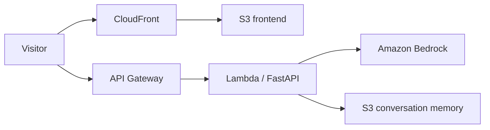

# Digital Twin

A conversational AI that represents [Robin Chriqui](https://www.linkedin.com/in/robinchriqui/) on the web: it answers questions about his background, skills, and projects in his voice.

**Live:** [robindigitaltwin.com](https://robindigitaltwin.com)

The twin is grounded on a LinkedIn profile, personal notes, and a communication style file. Conversations are remembered per session. The stack is a Next.js chat UI, a FastAPI backend on AWS Lambda, Amazon Bedrock for inference, and Terraform plus GitHub Actions for deploy.

## Architecture



| Layer | Role |
| --- | --- |
| Next.js (static export) | Chat UI, served from S3 + CloudFront |
| FastAPI on Lambda | `/chat` API, session memory, Bedrock calls |
| Amazon Bedrock | Foundation model (Nova) |
| S3 | Static site + per-session conversation history |
| Terraform | AWS infrastructure as code |
| GitHub Actions | OIDC deploy to `dev` / `test` / `prod` |

## Project layout

```
backend/          FastAPI app, Bedrock client, Lambda handler
  data/           Twin knowledge: facts, LinkedIn, summary, style
frontend/         Next.js chat interface
terraform/        AWS resources (Lambda, API Gateway, S3, CloudFront)
scripts/          deploy.sh / destroy.sh
.github/workflows CI/CD
```

Personalize the twin by editing `backend/data/`:

- `facts.json` — name, role, links
- `linkedin.md` — professional profile
- `summary.txt` — short bio used in the system prompt
- `style.txt` — tone of voice

## Local development

**Requirements:** Python 3.12, [uv](https://docs.astral.sh/uv/), Node.js 20+, AWS credentials with Bedrock access.

```bash
cp .env.example .env
# set DEFAULT_AWS_REGION (and AWS profile / keys via aws configure)
```

Backend:

```bash
cd backend
uv sync
uv run uvicorn server:app --reload --port 8000
```

Frontend (in another terminal):

```bash
cd frontend
npm install
# optional: echo 'NEXT_PUBLIC_API_URL=http://localhost:8000' > .env.local
npm run dev
```

Open [http://localhost:3000](http://localhost:3000). The API is at `http://localhost:8000` (`GET /health`, `POST /chat`).

Local chats are stored under `memory/` (gitignored). In AWS, the same JSON history lives in a private S3 bucket.

## Deploy

Push to `main` deploys to `dev`. Manual workflow dispatch can target `test` or `prod`.

```bash
./scripts/deploy.sh dev    # or test | prod
./scripts/destroy.sh dev   # tear down one environment
```

GitHub Actions assumes an AWS IAM role via OIDC (no long-lived access keys in the repo). Repository secrets: `AWS_ROLE_ARN`, `AWS_ACCOUNT_ID`, `DEFAULT_AWS_REGION`.

Production uses the custom domain in `terraform/prod.tfvars`.

## License

Copyright (c) 2026 Robin Chriqui. All rights reserved.

This project is **not** open source. You may look at the code; you may not copy, modify, or reuse it without written permission. See [LICENSE](LICENSE).
